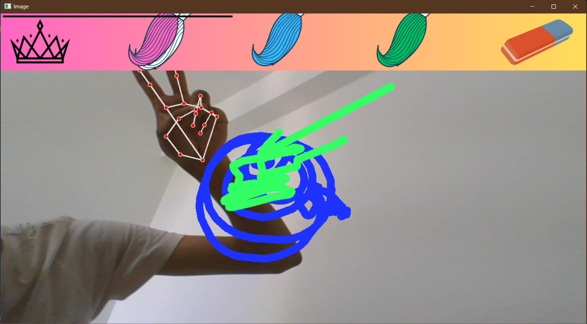

# AI Virtual Painter using Hand Tracking Module

This project showcases an AI virtual painter using the Hand Tracking Module in Python. It captures video from a webcam, detects and tracks hands, and allows you to draw and select colors using hand gestures.

## Prerequisites

Before running the code, ensure you have the required libraries installed:

- OpenCV (`cv2`)
- Hand Tracking Module (`HandTrackingModule`)

You can install OpenCV using:

```bash
pip install opencv-python
```

Coloring 
Selecting

## About the Code
The provided Python script aiVirtualPainter.py captures video from the webcam, utilizes the HandTrackingModule to detect and track hands, and enables you to draw and select colors using hand gestures. It provides both a drawing mode and a color selection mode.
